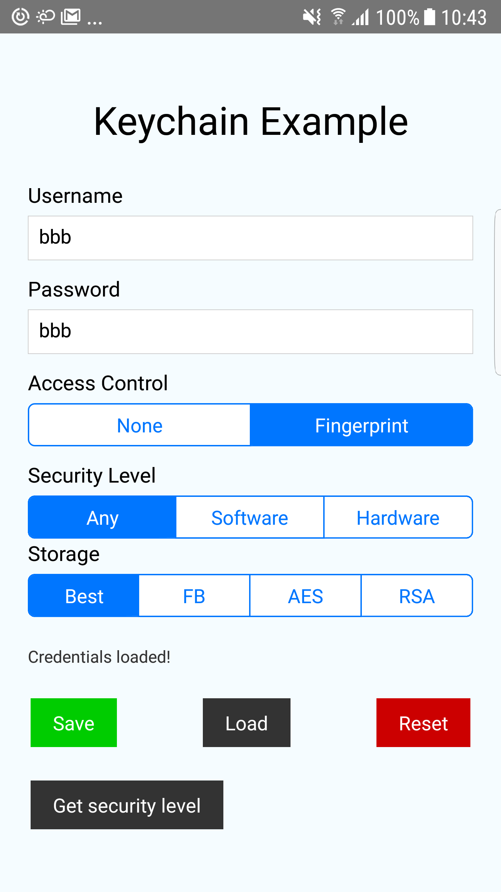

# RNKeyChainTest
Test project for react-native-keychain android problem

Test project for the bug ["Reading from Keychain fails occasionally"](https://github.com/oblador/react-native-keychain/issues/321).

Test device: Samsung Galaxy S6 Edge

Exception occured for me with react-native-keychain version 5.0.1.

Updated to version 6.0.0.

Used config in the example App with react-native keychain version 6.0.0:

